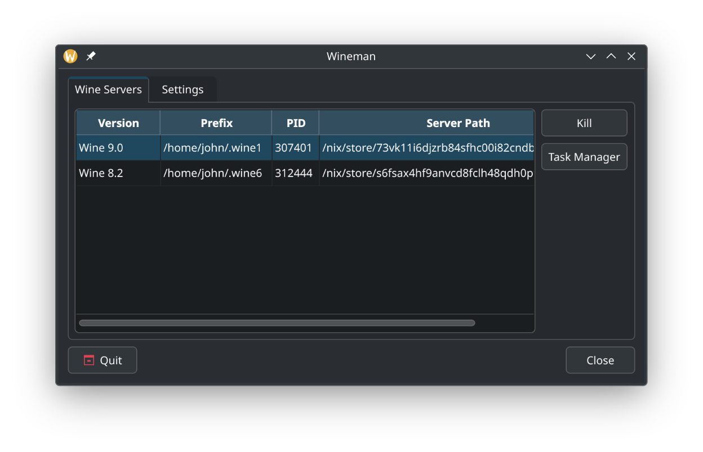

# Wineman

Wineman is a small Qt/C++ program that is designed to run in the background of a graphical user session and watch for running instances of Wine, as well as provide some basic tools.

This program is an experiment intended to explore some potential ways to improve the Linux desktop user experience.

This program should not be considered stable, and may still contain critical bugs or memory leaks.

## Usage

Wineman runs in the background. By default, when there are no running instances of Wine, it is invisible. It will show a tray icon when Wine is detected.

To quit Wineman when there are no running instances of Wine, you can start it a second time; it should display the UI, which has a quit button.

The intent is to have Wineman run at the start of a desktop session, using XDG Autostart or systemd user units, at which point it can provide ambient useful functionality and visibility for users that use Wine.
